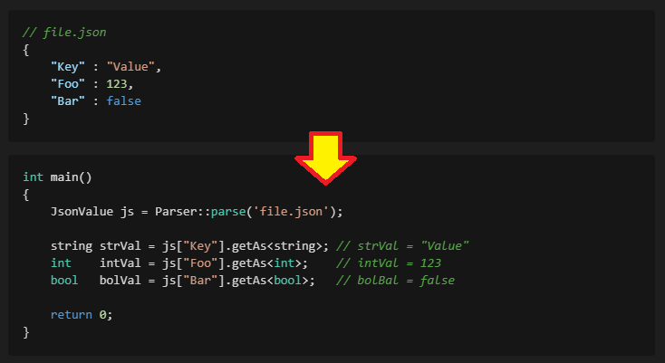

# TinyJson

<p align="center"></p>

---

- ### Simple Json Parser using C++ ( Reference by [jute](https://github.com/amir-s/jute) )
    > - [x] [Add] Can create json format within source code  
    > - [x] [Add] Simple json format validation
    > - [x] [Add] Save json data to file
    > - [x] [Add] Distinguish between integers and real numbers
    > - [x] [Add] Exception handling when invalid key and index values are referenced
    > - [x] [Add] Adding json data in a natural way in code ( json["key"] = value )
    > - [ ] [Add] foreach : key, value 

---

<br>

## Environment
- It works ``Linux``
- <u>No library dependencies</u>

<br>

## Compile & Run example
> **1. [Download]** git clone https://github.com/so686so/TinyJson.git
>  
> **2. [Compile]** g++ -o runFile TinyJson.h TinyJson.cpp main.cpp  
>  
> **3. [Run]** ./runFile  
---

<br>

## HOW TO USE

> **01.** [Load and Parse Json](#1-load-and-parse-json)  
> **02.** [Get value from key : objectn](#2-get-value-from-key--object)  
> **03.** [tryGetAs<T>()](#3-trygetas)  
> **04.** [Get value from index : array](#4-get-value-from-index--array)  
> **05.** [Check value type](#5-check-value-type)  
> **06.** [Set new value](#6-set-new-value)  
> **07.** [Replace value](#7-replace-value)  
> **08.** [Replace value 2](#8-replace-value-2)  
> **09.** [Make json ojbect : simple](#9-make-json-ojbect--simple)  
> **10.** [Make json ojbect : complex](#10-make-json-ojbect--complex)  
> **11.** [Make json ojbect : easy way](#11-make-json-ojbect--easy-way)  
> **12.** [File save](#12-file-save)  
> **13.** [Get keys or list](#13-get-keys-or-list)  

---

<br>

### 1. Load and Parse Json
- [ Sample Json File ] [**Data.json**](./Data.json)
```c++
//main.cpp

#include "TinyJson.h"

using namespace std;
using namespace TinyJson;

int main( void )
{
    // Parse target json file
    JsonValue js = Parser::parseFile( "./Data.json" );
    
    // Print Console
    cout << js.toString() << endl;

    return 0;
}
```

<details>
<summary> Result </summary>

```shell
# Console Stdout
{
 "repo_name": "TinyJson",
 "examples": [ {
   "author": "so686so",
   "name": "SoByungJun",
   "attr": [ {
     "key": "link",
     "value": "http://github.com/so686so/TinyJson"
    }, {
     "key": "target",
     "value": "_everyone_"
    } ]
  }, {
   "this_is": [ "array", "of", "strings" ],
   "number_array": [ 1, 2, 4, 8, 16 ],
   "pie": 3.14159,
   "boolean": true,
   "bug": null,
   "mixed": [ 1, 2, {
     "arg_1": -100.12345,
     "arg_2": false
    }, null, 0.17171771, true, [ "this", [ "in_array is", true ] ], "end list!" ]
  }, {
   "test_json": true
  }, {
   "control_chars": "hellow \\n worlds! \nice to meet you:tab:\tEND\bS\n"
  } ],
 "thanks": "amir-s",
 "reference_by": "https://github.com/amir-s/jute",
 "life": {
  "mean": {
   "is": 42
  }
 }
}
```

</details>

<br>

### 2. Get value from key : object
```c++
int main( void )
{
    JsonValue js = Parser::parseFile( "./Data.json" );

    // Use like, 'std::string value = js["repo_name"].getAs<string>();'
    auto repo = js["repo_name"].getAs<string>();

    cout << "key: repo_name, value: " << repo << endl;

    cout << js["thanks"].getAs<string>() << ", " 
         << js["life"]["mean"]["is"].getAs<int>() << endl;

    return 0;
}
```

<details>
<summary> Result </summary>

```shell
# Console Stdout
key: repo_name, value: TinyJson
amir-s, 42
```
</details>

<br>

### 3. tryGetAs<T>() 
```cpp
int main( void )
{
    JsonValue js = Parser::parseFile( "./Data.json" );

    // Use like, if( {value}.tryGetAs<T>( T& ref ) )
    // If tryGetAs result true, you can get value by ref
    int refInt = 0;
    if( ( js["repo_name"] ).tryGetAs<int>( refInt ) )
        cout << "try get success, value(int): " << refInt << endl;
    else
        cout << "try get failed, [\"repo_name\"] value is not int" << endl;

    string refStr = "";
    if( ( js["repo_name"] ).tryGetAs<string>( refStr ) )
        cout << "try get success, value(str): " << refStr << endl;
    else
        cout << "try get failed, [\"repo_name\"] value is not string" << endl;
}
```

<details>
<summary> Result </summary>

```shell
# Console Stdout
try get failed, ["repo_name"] value is not int
try get success, value(str): TinyJson
```

</details>

<br>

### 4. Get value from index : array
```cpp
int main( void )
{
    JsonValue js = Parser::parseFile( "./Data.json" );

    auto bool_value = js["examples"][1]["boolean"].getAs<bool>();
    if( bool_value == true ) {
        cout << "number is " << js["examples"][1]["number_array"][3].getAs<int>() << endl;
        cout << "pie value " << js["examples"][1]["pie"].getAs<double>() << endl;
    }

    return 0;
}
```

<details>
<summary> Result </summary>

```shell
# Console Stdout
number is 8
pie value 3.14159
```

</details>

<br>

### 5. Check value type
```cpp
int main( void )
{
    JsonValue js = Parser::parseFile( "./Data.json" );
    // get subset of json data
    JsonValue jsChild = js["examples"][1]["mixed"];

    cout << "isInt?    true  == " << boolalpha << jsChild[0].isInt()    << endl; // 1
    cout << "isInt?    false == " << boolalpha << jsChild[2].isInt()    << endl; // Object
    cout << "isDouble? true  == " << boolalpha << jsChild[4].isDouble() << endl; // 0.17171771
    cout << "isDouble? false == " << boolalpha << jsChild[0].isDouble() << endl; // 1
    cout << "isBool?   true  == " << boolalpha << jsChild[5].isBool()   << endl; // true
    cout << "isBool?   false == " << boolalpha << jsChild[3].isBool()   << endl; // null
    cout << "isString? true  == " << boolalpha << jsChild[7].isString() << endl; // "end list!"
    cout << "isObject? true  == " << boolalpha << jsChild[2].isObject() << endl; // object
    cout << "isArray?  true  == " << boolalpha << jsChild[6].isArray()  << endl; // array 
    cout << "isNull?   true  == " << boolalpha << jsChild[3].isNull()   << endl; // null

    return 0;
}
```

<details>
<summary> Result </summary>

```shell
# Console Stdout
isInt?    true  == true
isInt?    false == false
isDouble? true  == true
isDouble? false == false
isBool?   true  == true
isBool?   false == false
isString? true  == true
isObject? true  == true
isArray?  true  == true
isNull?   true  == true
```

</details>

<br>

### 6. Set new value
```cpp
int main( void )
{
    JsonValue js = Parser::parseFile( "./Data.json" );

    // js["NotYet"] is not set yet
    cout << js["NotYet"].toString() << ", isNull: " << boolalpha << js["NotYet"].isNull() << endl;

    // just add
    js["NotYet"] = "Hello World!";
    cout << js.toString() << endl;

    return 0;
}
```

<details>
<summary> Result </summary>

```shell
# Console Stdout
null, isNull: true
{
 "repo_name": "TinyJson",
 "examples": [ {
   "author": "so686so",
   "name": "SoByungJun",
   "attr": [ {
     "key": "link",
     "value": "http://github.com/so686so/TinyJson"
    }, {
     "key": "target",
     "value": "_everyone_"
    } ]
  }, {
   "this_is": [ "array", "of", "strings" ],
   "number_array": [ 1, 2, 4, 8, 16 ],
   "pie": 3.14159,
   "boolean": true,
   "bug": null,
   "mixed": [ 1, 2, {
     "arg_1": -100.12345,
     "arg_2": false
    }, null, 0.17171771, true, [ "this", [ "in_array is", true ] ], "end list!" ]
  }, {
   "test_json": true
  }, {
   "control_chars": "hellow \\n worlds! \nice to meet you:tab:\tEND\bS\n"
  } ],
 "thanks": "amir-s",
 "reference_by": "https://github.com/amir-s/jute",
 "life": {
  "mean": {
   "is": 42
  }
 },
 "NotYet": "Hello World!"
}
```

</details>

<br>

### 7. Replace value
```cpp
int main( void )
{
    JsonValue js = Parser::parseFile( "./Data.json" );
    // 42
    cout << "Before(int): " << js["life"]["mean"]["is"].getAs<int>() << endl;

    // A value can be replaced with a different type than the existing one.
    js["life"]["mean"]["is"] = "The reason for living isn't just coding...";

    // Do not enter the conditional statement
    if( js["life"]["mean"]["is"].isInt() ) 
        cout << "After(int):  " << js["life"]["mean"]["is"].getAs<int>() << endl;
        
    // Enter here : changed type string!
    if( js["life"]["mean"]["is"].isString() ) 
        cout << "After(str):  " << js["life"]["mean"]["is"].getAs<string>() << endl;
    return 0;
}
```

<details>
<summary> Result </summary>

```shell
# Console Stdout
Before(int): 42
After(str):  The reason for living isn't just coding...
```

</details>

<br>

### 8. Replace value 2
```cpp
int main( void )
{
    JsonValue js = Parser::parseFile( "./Data.json" );

    // Change value, Object
    js["life"]["mean"]["is"] = JsonObject("Language", "C++");
    // print pretty
    cout << js["life"]["mean"]["is"].toString() << endl;

    // Change value, null
    js["life"]["mean"]["is"] = JsonNULL();
    // print pretty
    cout << js["life"]["mean"]["is"].toString() << endl;

    // Change value, array
    js["life"]["mean"]["is"] = JsonArray(1, JsonNULL(), true, -3.5, "ABC");
    // print pretty
    cout << js["life"]["mean"]["is"].toString() << endl;

    return 0;
}
```

<details>
<summary> Result </summary>

```shell
# Console Stdout
{
 "Language": "C++"
}
null
[ 1, null, true, -3.5, "ABC" ]
```

</details>

<br>

### 9. Make json ojbect : simple
```cpp
int main( void )
{
    // Insert key:value directly while creating json format
    JsonValue jsSmp = JsonObject("Key", "value");
    // print pretty
    cout << jsSmp.toString() << endl;

    return 0;
}
```

<details>
<summary> Result </summary>

```shell
# Console Stdout
{
 "Key": "value"
}
```

</details>

<br>

### 10. Make json ojbect : complex
```cpp
int main( void )
{
    // make empty json format
    JsonValue jsCpx = JsonObject();

    // insert data using chain method
    jsCpx.addObject( "First",  1 )
         .addObject( "Second", 4.56 )
         .addObject( "Array",  JsonArray ( "1", 3.45, "Test", true ) )
         .addObject( "Child",  JsonObject( "ch1", 11 )
                              .addObject ( "ch2", 22 )
                              .addObject ( "GrandChild", JsonArray( "1", 3.45, "Test", true ) ) )
         .addObject( "Third",  JsonNULL() )
         .addObject( "Last",   false );

    // print pretty
    cout << jsCpx.toString() << endl;
    return 0;
}
```

<details>
<summary> Result </summary>

```shell
# Console Stdout
{
 "First": 1,
 "Second": 4.56,
 "Array": [ "1", 3.45, "Test", true ],
 "Child": {
  "ch1": 11,
  "ch2": 22,
  "GrandChild": [ "1", 3.45, "Test", true ]
 },
 "Third": null,
 "Last": false
}
```

</details>

<br>

### 11. Make json ojbect : easy way
```cpp
int main( void )
{
    JsonValue jsEasy = JsonObject();

    jsEasy["Hello"]    = "World";
    jsEasy["Count"]    = 777;
    jsEasy["Nullable"] = JsonNULL();
    jsEasy["List"]     = JsonArray( 1, 2, 3, 4 );
    jsEasy["List2"]    = "[ 4, 5, 6, 7, { \"inList\": [ true, null, -3, 0.123 ] }, false ]";
    jsEasy["Objects"]  = JsonObject( "child", "value" );
    jsEasy["Objects2"] = "{ \"Child2\" : \"value2\", \"My\": null }";

    // print pretty
    cout << jsEasy.toString() << endl;

    return 0;
}
```

<details>
<summary> Result </summary>

```shell
# Console Stdout
{
 "Hello": "World",
 "Count": 777,
 "Nullable": null,
 "List": [ 1, 2, 3, 4 ],
 "List2": [ 4, 5, 6, 7, {
   "inList": [ true, null, -3, 0.123 ]
  }, false ],
 "Objects": {
  "child": "value"
 },
 "Objects2": {
  "Child2": "value2",
  "My": null
 }
}
```

</details>

<br>

### 12. File save
```cpp
int main( void )
{
    JsonValue js = Parser::parseFile( "./Data.json" );

    js.saveFile( "test_sjon_to_file_echo.json" );

    return 0;
}
```

<details>
<summary> Result </summary>

```bash
# Console Stdout
'File save done : test_sjon_to_file_echo.json'
```

</details>

<br>

### 13. Get keys or list
```cpp
int main( void )
{
    JsonValue js = Parser::parseFile( "./Data.json" );

    // get keys
    for( auto& k : js.keys() ) cout << k << endl;

    // get lists
    for( auto& eachValue : js["examples"].list() ) {
        cout << "----------------------------------------------" << endl;
        cout << eachValue.toString() << endl;
    }

    return 0;
}
```

<details>
<summary> Result </summary>

```bash
# Console Stdout
repo_name
examples
thanks
reference_by
life
NotYet
----------------------------------------------
{
 "author": "so686so",
 "name": "SoByungJun",
 "attr": [ {
   "key": "link",
   "value": "http://github.com/so686so/TinyJson"
  }, {
   "key": "target",
   "value": "_everyone_"
  } ]
}
----------------------------------------------
{
 "this_is": [ "array", "of", "strings" ],
 "number_array": [ 1, 2, 4, 8, 16 ],
 "pie": 3.14159,
 "boolean": true,
 "bug": null,
 "mixed": [ 1, 2, {
   "arg_1": -100.12345,
   "arg_2": false
  }, null, 0.17171771, true, [ "this", [ "in_array is", true ] ], "end list!" ]
}
----------------------------------------------
{
 "test_json": true
}
----------------------------------------------
{
 "control_chars": "hellow \\n worlds! \nice to meet you:tab:\tEND\bS\n"
}
```

</details>

<br>

---  

## License: [MIT](https://opensource.org/licenses/MIT)
