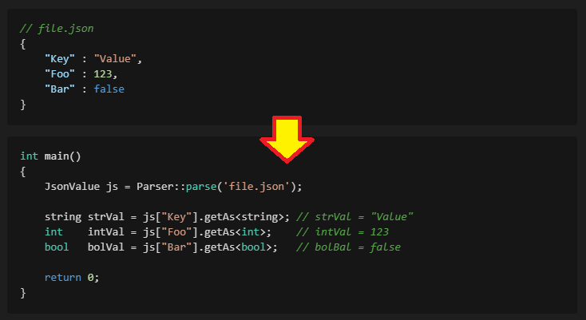

# TinyJson

<p align="center"></p>

## C++를 이용한 간단하고 강력한 JSON Parser

- **Reference**: [jute](https://github.com/amir-s/jute)
- **단 두 개의 1000줄 미만의 코드 파일**로 작동합니다. ( `TinyJson.h`, `TinyJson.cpp` )
- 외부 의존성이 전혀 없는 **C++14** 표준 준수 라이브러리입니다.
- **[nlohmann/json](https://github.com/nlohmann/json)** 스타일의 직관적인 문법을 지향합니다.

### 주요 개선 사항 (Refactored Features)

> * [x] **Simple Use**: 직관적인 JSON 작성 문법 지원 ( `json["key"] = value` )
> * [x] **Iterator 지원**: 표준 `begin()/end()` 및 `range-based for` 문법 완벽 지원
> * [x] **Key-Value 순회**: `.items()` 메서드를 통한 nlohmann 스타일의 `{key, value}` 순회 지원
> * [x] **Method Chaining**: `addObject`, `addElementToArray`를 이용한 유려한 객체 생성
> * [x] **Strict Parsing**: 엄격한 파싱 및 유효성 검사 로직 적용
> * [x] **Type Safety**: `tryGetAs<T>()`를 통한 안전한 타입 변환
> * [x] **Smart Keys**: 배열 순회 시 인덱스를 자동으로 Key(숫자/문자열)로 변환
> * [x] **Exception**: 파싱 오류 및 잘못된 접근 시 `TinyJsonException` 발생
> * [x] **Unit Tests**: Catch2 v3.5.0 기반의 100% 커버리지 테스트 코드 제공

---

## 개발 환경 및 빌드

* **Language**: `C++14` 이상
* **Build System**: `CMake` (v3.14 이상 권장) 혹은 기본 `g++`
* **Dependencies**: **없음** (단위 테스트 실행 시에만 `CPM`을 통해 `Catch2` 자동 다운로드)

### 프로젝트 가져오기

`include/TinyJson.h`와 `src/TinyJson.cpp` 두 파일만 프로젝트에 복사하여 사용하면 됩니다.

### 예제 및 테스트 빌드 방법

```bash
# 1. 빌드 디렉토리 생성 및 이동
mkdir build && cd build

# 2. CMake 설정
cmake ..

# 3. 빌드 (라이브러리, 예제, 테스트 코드 모두 빌드됨)
cmake --build .

# 4. 단위 테스트 실행
./unit_tests

# 5. 예제 코드 실행 (프로젝트 루트 폴더에 생성됨)
./TinyJsonExample

# 만약 CMake를 사용하지 않고 g++ 명령어만 이용해서 컴파일 하고 싶다면 아래 명령어 입력
# g++ -o TinyJsonExample -I./include src/TinyJson.cpp main.cpp

```

---

## HOW TO USE (사용법)

### 1. JSON 로드 및 파싱 (Load & Parse)

파일 경로 또는 문자열로부터 JSON을 파싱합니다.

```cpp
#include "TinyJson.h"
using namespace TinyJson;

try {
    // 파일에서 로드
    Json js = Parser::parseFile( "data/Data.json" );

    // 문자열에서 로드
    Json jsStr = Parser::parse( "{\"key\": \"value\"}" );

    // 출력 (Pretty Print)
    std::cout << js.toString( ToStringType::Pretty ) << std::endl;
}
catch( const TinyJsonException& e ) {
    std::cerr << e.what() << std::endl;
}

```

### 2. 값 접근 및 타입 변환 (Access & Casting)

`[]` 연산자를 사용해 접근하며, `getAs<T>()`로 값을 변환합니다.

```cpp
// Object 접근
std::string name = js["project"]["name"].getAs<std::string>();

// Array 접근
int version = js["versions"][0].getAs<int>();

// 타입 확인
if ( js["active"].isBool() ) {
    bool isActive = js["active"].getAs<bool>();
}

```

### 3. 안전한 값 가져오기 (Safe Access)

Json 에 특정 키가 존재하는지 확인하고 싶을 때는 `contains`를 사용하세요.  
키가 존재하는지, 타입이 맞는지 확실하지 않을 때는 `tryGetAs`를 사용하세요.

```cpp

// contains: 특정 키 값을 가지고 있는지 체크 가능
if ( js.contains( "count" ) == false ) {
    std::cout << "해당 key 값을 가지고 있지 않습니다." << std::endl;
}

// tryGetAs : 성공 시 true 반환 및 refVal에 값 할당
int refVal = 0;

if ( js["count"].tryGetAs<int>( refVal ) ) {
    std::cout << "Count: " << refVal << std::endl;
} else {
    std::cout << "값이 없거나 정수 타입이 아닙니다." << std::endl;
}

```

### 4. JSON 객체/배열 생성 (Construction & Chaining)

메서드 체이닝을 통해 복잡한 JSON 구조를 한 번에 생성할 수 있습니다.

```cpp
// Object 생성
Json myObj = JsonObject();
myObj.addObject( "name", "TinyJson" )
     .addObject( "version", 2.5 )
     .addObject( "meta", JsonObject( "author", "Tom" ) );

// 혹은 더 직관적인 방법으로도 생성 가능
myObj["name_simple"]    = "TinyJson_2";
myObj["version_simple"] = 2.5;
myObj["meta_simple"]    = JsonObject( "author", "Jude" );

// Array 생성 (Mixed Types)
Json myArr = JsonArray();
myArr.addElementToArray( 1, 2, 3 )          // 가변 인자 지원
     .addElementToArray( "Start", "End" )
     .addObject( "nested", "object" );      // 배열 안에 객체 삽입 자동 처리

```

### 5. 반복문 순회 (Iteration)

**A. 일반 순회 (값만 필요할 때)**
`nlohmann/json`과 동일하게 값(Value)의 참조만 순회합니다.

```cpp
Json numbers = JsonArray( 10, 20, 30 );

// val은 Json& 타입입니다.
for ( auto& val : numbers ) {
    val = val.getAs<int>() + 1; // 원본 값 수정 가능 (11, 21, 31)
}

```

**B. items() 순회 (키와 값이 모두 필요할 때)**
`.key()`와 `.value()`를 제공하는 프록시 객체를 반환합니다.

```cpp
Json obj = JsonObject( "A", 1 ).addObject( "B", 2 );

for ( auto item : obj.items() ) {
    std::cout << "Key: " << item.key() << ", Val: " << item.value().getAs<int>() << std::endl;
}

// 배열에서 items()를 사용하면 key()는 '인덱스'가 됩니다.
Json arr = JsonArray( 100, 200 );
for ( auto item : arr.items() ) {
    size_t idx = item.key(); // 자동으로 숫자로 변환됨!
    std::cout << "Index [" << idx << "] = " << item.value().getAs<int>() << std::endl;
}

```

### 6. 수정 및 저장 (Modify & Save)

```cpp
// 값 수정
js["repo_name"] = "TinyJson-Refactored";

// 파일로 저장
if ( js.saveFile( "output.json" ) ) {
    std::cout << "저장 완료" << std::endl;
}

```

---

## 주의 사항

* **TinyJsonException**: 파싱 실패, 잘못된 타입 접근, Const 객체에서의 없는 키 참조 시 예외가 발생하므로 `try-catch` 처리를 권장합니다.
* **프로젝트 목적**: 이 프로젝트는 학습 및 경량화 목적으로 제작되었습니다. 극한의 성능이나 모든 JSON 표준 스펙(예: 방대한 유니코드 처리 등)이 필요한 프로덕션 환경에서는 [nlohmann/json](https://github.com/nlohmann/json) 또는 [RapidJSON](https://github.com/Tencent/rapidjson) 사용을 고려하세요.

---

## License

[MIT License](https://opensource.org/licenses/MIT)

